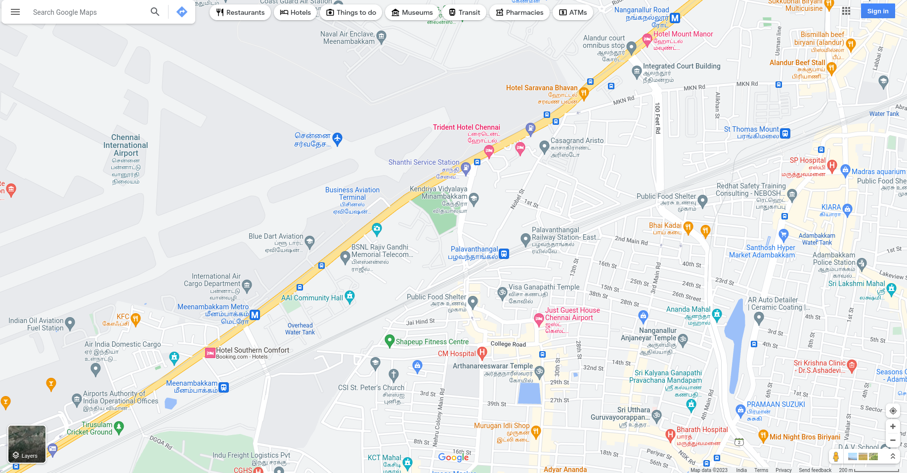

# Places Around Me
## AIM:
To develop a website to display details about the places around my house.

## Design Steps:

### Step 1:
Go to image maps and create image mapping
### Step 2:
Link the given image map to different webpages
### Step 3:
Run the server and check for the website

## Code:

<!DOCTYPE html>
<html lang="en">
    <head>
        <title>My City</title>
    </head>
    <body>
        <h1 align="center">
            <b>Nanganallur</b>
        </h1>
        <h3 align="center">
            <b>Vanitha S(22008870)</b>
        </h3>
        

            
            <map name="image-maps-2023-01-13-033840" id="ImageMapsCom-image-maps-2023-01-13-033840">

                <area  alt="" title="Nanganallur Anjaneyar Temple" href="anjaneyar.html" shape="rect" coords="1358,664,1408,714" style="outline:none;" target="_self">
                <area  alt="" title="Pazhavanthangal Railway Station" href="railways.html" shape="rect" coords="1039,460,1089,510" style="outline:none;" target="_self"     />
                <area  alt="" title="Kendriya Vidyalaya" href="kv.html" shape="rect" coords="932,381,984,431" style="outline:none;" target="_self">
                <area  alt="" title="Arthanareeswarar Temple" href="at.html" shape="rect" coords="1066,731,1118,781" style="outline:none;" target="_self">
                <area  alt="" title="Chennai International Airport" href="airport.html" shape="rect" coords="202,267,307,376" style="outline:none;" target="_self">
                <area shape="rect" coords="1833,957,1835,959" alt="Image Map" style="outline:none;" title="Image Map" href="https://www.image-maps.com/" />
                
            </map>
        

    </body>
</html>
## Output:

## Result:
The program for places around me through image mapping is completed successfully.
